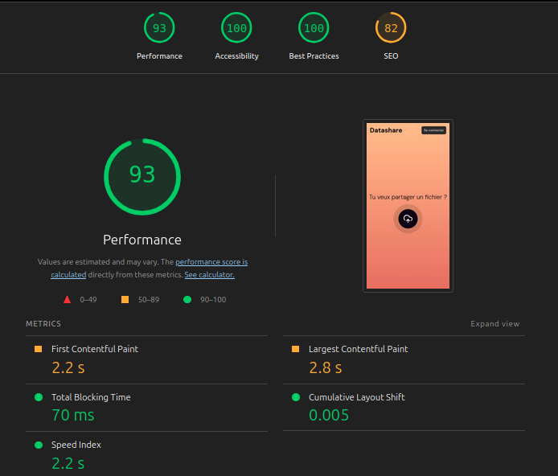
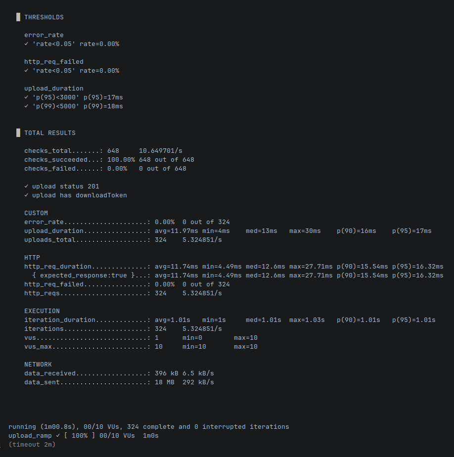

# PERF.md — Rapport de performance Datashare

> Date : 2026-03-13 Environnement : développement local (localhost), PostgreSQL
> 16, Node.js (NestJS), Vite 7

---

## 1. Performance Front-end

Build généré avec `npm run build` dans `/frontend` (Vite 7, TypeScript, Chakra
UI).

### 1.1 Analyse du bundle (production build)

| Ressource        | Valeur mesurée |
| ---------------- | -------------- |
| JS total (brut)  | 721 KB         |
| JS total (gzip)  | 218 KB         |
| CSS total (gzip) | 0,77 KB        |
| Fonts (woff2)    | 274 KB         |
| Plus gros chunk  | 511 KB         |

> ⚠️ Vite émet un avertissement : le plus gros chunk dépasse la limite
> recommandée de 500 KB

### 1.2 Métriques Lighthouse (production build, `http://localhost:4173`)

Exécuté avec `npx lighthouse` en mode headless Chrome.

### Scores globaux

| Catégorie        | Score     |
| ---------------- | --------- |
| Performance      | 93 / 100  |
| Accessibilité    | 100 / 100 |
| Bonnes pratiques | 100 / 100 |
| SEO              | 82 / 100  |

#### Core Web Vitals et métriques de chargement

| Métrique                       | Valeur | Score | Cible "Good" |
| ------------------------------ | ------ | ----- | ------------ |
| First Contentful Paint (FCP)   | 2,2 s  | 0,77  | < 1,8 s      |
| Largest Contentful Paint (LCP) | 2,8 s  | 0,83  | < 2,5 s      |
| Total Blocking Time (TBT)      | 70 ms  | 0,99  | < 200 ms     |
| Cumulative Layout Shift (CLS)  | 0,005  | 1,00  | < 0,1        |
| Speed Index                    | 2,2 s  | 0,99  | < 3,4 s      |
| Time to Interactive (TTI)      | 2,8 s  | 0,97  | < 3,8 s      |

#### Opportunités détectées par Lighthouse

| Opportunité       | Économie estimée | Détail                             |
| ----------------- | ---------------- | ---------------------------------- |
| Unused JavaScript | ~150 ms / 37 KB  | Dead code dans le bundle Chakra UI |

### Capture

### 1.3 Budget de performance

| Ressource / Métrique   | Valeur actuelle | Seuil cible projet | Statut |
| ---------------------- | --------------- | ------------------ | ------ |
| JS total (gzip)        | 218 KB          | < 225 KB           | ✅     |
| Plus gros chunk (brut) | 511 KB          | < 500 KB           | ⚠️     |
| FCP                    | 2,2 s           | < 1,8 s            | ⚠️     |
| LCP                    | 2,8 s           | < 2,5 s            | ⚠️     |
| TBT                    | 70 ms           | < 200 ms           | ✅     |

- La cible JS gzip correspond à un chargement en moins de 200 ms sur une
  connexion 4G moyenne (9 Mb/s).
  - temps (ms) = taille (KB) × 8 / débit (Mb/s) × 1000 → (225 × 8 / 9) × 1000 =
    200 ms
- Les seuils FCP/LCP/TBT sont issus des Core Web Vitals Google.
- Le seuil du chunk (500 KB) correspond à la limite d'avertissement Vite.

---

## 2. Performance Back-end

- **Outil** : k6
- **Script** : `k6-perf.js` (à la racine du projet)
- **Endpoint testé** : `POST /files` (upload anonyme)
- **Fichier de test** : `cactus.gif` (~54 KB, `image/gif`) -> fichier réel, car
  le backend vérifie le type MIME via les magic bytes
- **Durée totale** : 60 secondes
- **Scénario** : `upload_ramp` — montée en charge de 0 à 10 VUs (Virtual Users)
  sur `POST /files`
  - 0 → 5 VUs en 15 s, 5 → 10 VUs en 30 s, 10 → 0 VUs en 15 s

### 2.1 Résultats

Tableaux récapitulatifs

| Endpoint               | Avg      | Médiane | p(90) | p(95) | p(99) | Max   | Seuil p(95) | Statut |
| ---------------------- | -------- | ------- | ----- | ----- | ----- | ----- | ----------- | ------ |
| `POST /files` (upload) | 11,97 ms | 13 ms   | 16 ms | 17 ms | 18 ms | 30 ms | < 3 000 ms  | ✅     |

| Métrique                  | Valeur            |
| ------------------------- | ----------------- |
| Durée du test             | 60,8 s            |
| VUs max simultanés        | 10                |
| Requêtes totales          | 324               |
| Débit                     | ~5,3 req/s        |
| Taux d'erreur HTTP        | 0,00 %            |
| Taux d'erreur fonctionnel | 0,00 %            |
| Uploads réussis           | 324 (~5,3/s)      |
| Volume envoyé             | 18 MB (292 KB/s)  |
| Volume reçu               | 396 KB (6,5 KB/s) |
| Latence globale p(95)     | 16,32 ms          |

### Capture

## 3. Journal des métriques clés

| Date       | Contexte                           | FCP   | LCP   | JS gzip | Back p(95) | Taille transférée | Notes           |
| ---------- | ---------------------------------- | ----- | ----- | ------- | ---------- | ----------------- | --------------- |
| 2026-03-13 | Baseline (production build, local) | 2,2 s | 2,8 s | 218 KB  | 17 ms      | ~18 MB (k6, 60s)  | Mesure initiale |

## 4. Analyse et pistes d'optimisation

### 4.1 Constats

- **Front-end** : Le bundle est relativement lourd (721 KB brut, 218 KB gzip),
  principalement à cause de Chakra UI (511 KB). Le FCP et le LCP dépassent les
  cibles recommandées, ce qui suggère que le chargement initial est ralenti par
  ce bundle volumineux. Le TBT et le CLS sont excellents, indiquant une bonne
  réactivité et stabilité visuelle.
- **Back-end** : L'endpoint d'upload est performant, avec un p(95) de 17 ms pour
  un fichier de 54 KB. Le débit est limité par le `sleep(1)` du script de test,
  mais en conditions réelles, la capacité serait nettement supérieure. Aucun
  taux d'erreur n'a été détecté, ce qui est un bon signe de stabilité.

### 4.2 Suggestions d'amélioration

**Front-end**

1. **Réduire le chunk Chakra UI (511 KB)** : C'est le principal levier pour
   améliorer le FCP et le LCP. Lighthouse estime 37 KB / 150 ms récupérables en
   supprimant le code inutilisé. Suivre le guide officiel d'optimisation de
   bundle Chakra UI v3 — voir
   https://chakra-ui.com/guides/component-bundle-optimization

2. **Optimiser le chargement des polices** : Les fonts représentent 274 KB, soit
   plus que le JS compressé (218 KB). Deux pistes identifiées :
   - Ajouter `font-display: swap` pour éviter que le texte soit invisible
     pendant le chargement des polices
   - Réduire le subset des caractères inclus pour diminuer le poids des fichiers

**Back-end**

1. **Tester avec des fichiers volumineux** : Le test k6 utilisait un fichier de
   54 KB, alors que l'application accepte des uploads jusqu'à 1 Go. Rejouer le
   scénario avec des fichiers proches de cette limite permettrait de vérifier
   que les temps de réponse restent acceptables et que le serveur ne sature pas.

2. **Index PostgreSQL sur `expiresAt`** : Ce cas n'est pas couvert par le test
   k6 car le `FilesCleanupService` est un job nocturne. Ajouter un index sur
   `expiresAt` éviterait un scan complet de la table `files` à chaque exécution.
