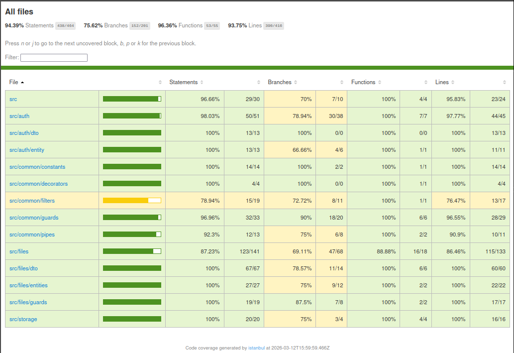
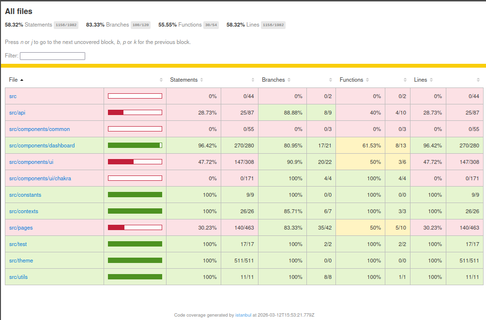

# TESTING.md — Stratégie de tests

## Vue d'ensemble

| Niveau      | Outil                    | Emplacement     | Commande                                       |
| ----------- | ------------------------ | --------------- | ---------------------------------------------- |
| Unitaire    | Jest                     | `backend/src/`  | `npm run test --workspace=backend`             |
| Intégration | Jest                     | `backend/test/` | `npm run test:integration --workspace=backend` |
| Unitaire    | Vitest + Testing Library | `frontend/src/` | `npm run test --workspace=frontend`            |
| E2E         | Playwright (Chromium)    | `e2e/tests/`    | `npm run test:e2e`                             |

---

## Instructions d'exécution

### Tests unitaires backend

```bash
npm run test --workspace=backend
```

Aucun prérequis — les dépendances externes sont mockées.

### Tests d'intégration backend

```bash
npm run test:integration --workspace=backend
```

Prérequis : une base de données PostgreSQL doit être disponible (voir
`DATABASE_URL` dans `.env`).

```bash
# Démarrer la base de données si ce n'est pas déjà fait
npm run db:start
```

### Tests unitaires (frontend)

```bash
npm run test --workspace=frontend
```

Aucun prérequis — le client HTTP est mocké via `vi.mock`.

### Tests E2E

Les tests E2E nécessitent que le backend et le frontend soient lancés, ainsi
qu'une base de données active.

```bash
# 1. Démarrer la base de données
npm run db:start

# 2. Lancer l'application
npm run dev

# 3. Installer Chromium (à faire une seule fois)
npx playwright install chromium --only-shell

# 4. Lancer les tests
npm run test:e2e

# Interface graphique (optionnel)
npm run test:e2e:ui
```

---

## Plan de tests

### Tests unitaires backend

#### Auth

| Composant                        | Ce qui est couvert                                                                                                                                                                                |
| -------------------------------- | ------------------------------------------------------------------------------------------------------------------------------------------------------------------------------------------------- |
| `AuthService`                    | Inscription silencieuse sur email dupliqué ; relance des autres `QueryFailedError` ; retour du `access_token` avec le bon payload JWT ; mitigation timing-attack (hash factice sur email inconnu) |
| `CreateUserDto` / `LoginUserDto` | Email valide/invalide ; mot de passe < 8 caractères ; champs absents                                                                                                                              |
| `UserEntity`                     | Mot de passe haché par le hook `@BeforeInsert`                                                                                                                                                    |

#### Fichiers

| Composant                                         | Ce qui est couvert                                                                                                                                                         |
| ------------------------------------------------- | -------------------------------------------------------------------------------------------------------------------------------------------------------------------------- |
| `FileSizePipe`                                    | `400` si aucun fichier ; `413` si taille dépassée ; fichier retourné inchangé dans la limite (y compris à la limite exacte)                                                |
| `FilesService.upload`                             | Rejet MIME non autorisé ou non détectable ; chemins authentifié/anonyme ; token hex 64 chars ; calcul `expiresAt` ; rollback DB si écriture en stockage échoue             |
| `FilesService.getInfoByToken` `getBufferByToken`  | Retour des métadonnées et du contenu ; chemins authentifié/anonyme ; `404` token inconnu ; `410` fichier expiré ou ENOENT ; relance des autres erreurs de stockage         |
| `FilesService.deleteFile`                         | Suppression stockage + DB + insertion `file_history` ; anonymes exclus de l'historique mais supprimés de la DB ; historique créé même si la suppression du stockage échoue |
| `FilesService.findExpiredFiles` `listUserHistory` | Filtrage par `expiresAt` passé ; respect du `limit` ; tri `deletedAt` DESC                                                                                                 |
| `FilesCleanupService`                             | Appelle `deleteFile` pour chaque fichier expiré ; continue sur erreur ; ne lève jamais d'exception                                                                         |

---

### Tests d'intégration backend

#### Auth

| Endpoint              | Cas couverts                                                                                                                |
| --------------------- | --------------------------------------------------------------------------------------------------------------------------- |
| `POST /auth/register` | `201` sur données valides ; `201` sur email dupliqué (ne révèle pas l'existence du compte)                                  |
| `POST /auth/login`    | `200` + `access_token` sur credentials valides ; `401 AUTH_INVALID_CREDENTIALS` sur mot de passe incorrect ou email inconnu |

#### Fichiers

| Endpoint                             | Cas couverts                                                                                                                                |
| ------------------------------------ | ------------------------------------------------------------------------------------------------------------------------------------------- |
| `POST /files`                        | `201` authentifié et anonyme ; chemin `anonymous/{fileId}` vérifié ; `413 FILE_TOO_LARGE` ; `415 FILE_TYPE_FORBIDDEN`                       |
| `GET /files/download/:token`         | `200` + métadonnées (authentifié et anonyme) ; `404 FILE_NOT_FOUND`                                                                         |
| `GET /files/download/:token/content` | `200` avec `Content-Type` et `Content-Disposition` corrects ; `404 FILE_NOT_FOUND` ; `410 FILE_GONE` si absent du disque                    |
| `DELETE /files/:id`                  | `204` + suppression ligne + fichier + `file_history` ; `401` sans token ; `403` mauvais propriétaire ; `404` inexistant                     |
| `GET /files/history`                 | Liste vide ; entrée après suppression ; tri `deletedAt` DESC ; pagination ; `400` si `page < 1` ; `401` sans token ; isolation utilisateurs |
| `GET /files`                         | Liste vide ; pagination ; `400` si `page < 1` ; isolation utilisateurs                                                                      |

---

### Tests E2E

| Domaine          | Cas couverts                                                                                                                                                             |
| ---------------- | ------------------------------------------------------------------------------------------------------------------------------------------------------------------------ |
| Authentification | Inscription ; connexion valide (redirection) ; connexion invalide (message d'erreur) ; accès sans token (redirection `/login`) ; déconnexion (accès `/my-files` révoqué) |
| Upload           | Upload authentifié (fichier visible dans la liste) ; type interdit (message d'erreur, pas d'upload)                                                                      |
| Téléchargement   | Téléchargement via lien de partage ; message "fichier expiré" sur lien supprimé ou inexistant                                                                            |
| Mes fichiers     | Liste des fichiers ; isolation (fichiers d'un autre utilisateur invisibles) ; suppression (disparition immédiate) ; onglet "Expiré" (fichier supprimé visible)           |

---

### Tests unitaires frontend

#### Auth & navigation

| Composant         | Ce qui est couvert                                                                                                                                                             |
| ----------------- | ------------------------------------------------------------------------------------------------------------------------------------------------------------------------------ |
| `AuthContext`     | État anonyme/authentifié selon le localStorage ; `login` stocke le token ; `logout` supprime le token et redirige vers `/login` ; handler `unauthorized` enregistré au montage |
| `DashboardLayout` | Redirection `/login` si non authentifié ; rendu de la page protégée si authentifié                                                                                             |
| `api/client`      | En-tête `Authorization: Bearer` ajouté si token présent, omis sinon ; handler `unauthorized` appelé sur `401`, sauf pour `/auth/login`                                         |

#### Fichiers

| Composant           | Ce qui est couvert                                                                                                                                                                                                                                                           |
| ------------------- | ---------------------------------------------------------------------------------------------------------------------------------------------------------------------------------------------------------------------------------------------------------------------------- |
| `MyFilesPage`       | Onglet Actifs → `listFiles("active")` ; Expiré → `listFiles("expired")` + `listFileHistory` ; Tous → `listFiles("all")` + `listFileHistory` ; suppression optimiste ; message d'erreur API ; pagination ; reset page sur changement d'onglet ; état vide ; bannière d'erreur |
| `DownloadCard`      | Fichier introuvable ou expiré → message sans bouton ; expire aujourd'hui/demain/dans N jours → avertissement adapté avec bouton                                                                                                                                              |
| `UploadSuccessCard` | Libellé français pour chaque TTL prédéfini ; format de repli pour TTL inconnu ; URL de partage construite depuis le `download_token`                                                                                                                                         |
| `FileRow`           | Variante active : nom, expiration, bouton Supprimer, lien, appel `onDelete` au clic ; variante historique : nom, mention "Expiré", sans bouton ni lien                                                                                                                       |
| `formatExpiry`      | `"Expiré"` (passé) ; `"Expire aujourd'hui"` ; `"Expire demain"` ; `"Expire dans N jours"`                                                                                                                                                                                    |

---

## Couverture de code

### Objectif

Couverture minimale cible : **70%** sur le backend et le frontend.

### Générer le rapport

```bash
# Backend — tests unitaires uniquement
npm run test:cov --workspace=backend

# Backend — unitaires + intégration
npm run test:cov:all --workspace=backend

# Frontend
npm run test:coverage --workspace=frontend
```

Les rapports HTML sont générés dans `backend/coverage/` (tests unitaires),
`backend/coverage/all` (tests unitaires et d'intégration) et
`frontend/coverage/`.

### Résultats

#### Backend

| Métrique   | Résultat | Objectif |
| ---------- | -------- | -------- |
| Statements | 94.39%   | ≥ 70%    |
| Branches   | 75.62%   | ≥ 70%    |
| Functions  | 96.36%   | ≥ 70%    |
| Lines      | 93.75%   | ≥ 70%    |



#### Frontend

La métrique retenue pour le frontend est la couverture de **branches** (logique
conditionnelle). L'objectif est de couvrir la logique métier implémentée en plus
du framework, et non le framework lui-même.

| Métrique   | Résultat | Objectif |
| ---------- | -------- | -------- |
| Statements | 58.32%   | —        |
| Branches   | 83.33%   | ≥ 70%    |
| Functions  | 55.55%   | —        |
| Lines      | 58.32%   | —        |



---

## Conventions

- Les tests d'intégration backend nettoient la BDD via des appels au repository
  dans `afterEach` — pas d'utilitaire partagé.
- Les tests E2E n'effectuent pas de nettoyage de la BDD — l'isolation repose sur
  des emails uniques générés avec `Date.now()`.
- Les tests d'intégration backend génèrent le contenu des fichiers en mémoire
  (`Buffer`) — rien n'est écrit sur le disque.
- Les tests frontend mockent la couche `api/*` via `vi.mock` — aucun appel HTTP
  réel.
